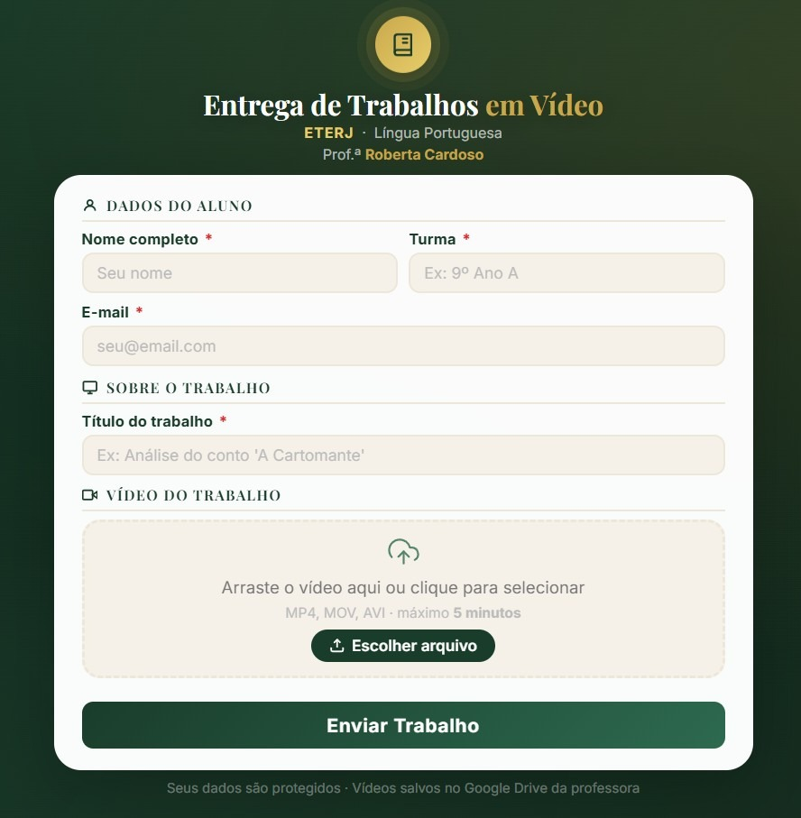
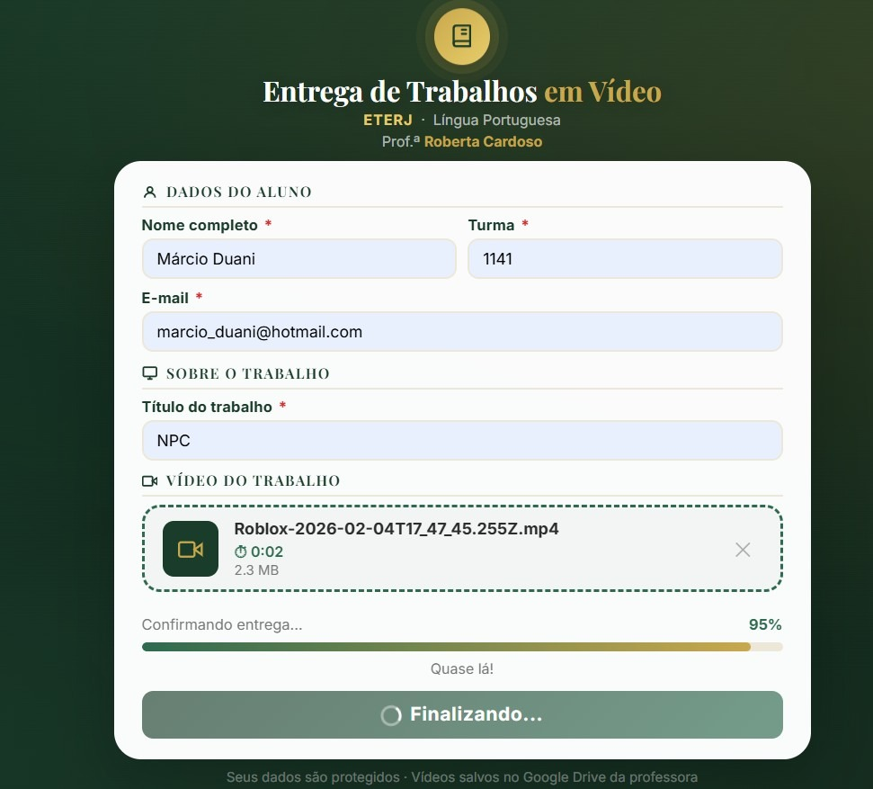
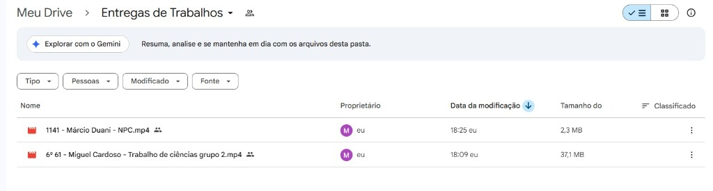
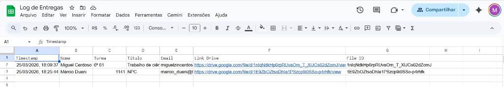

# 📽️ Plataforma de Entrega de Trabalhos em Vídeo

> Sistema web para alunos enviarem vídeos de trabalhos escolares diretamente para o **Google Drive** da professora, com confirmação automática por e-mail e registro em Google Sheets — desenvolvido para a **Prof.ª Roberta Cardoso · ETERJ · Língua Portuguesa**.

---

## ✨ Funcionalidades

| # | Funcionalidade | Detalhes |
|---|---|---|
| 1 | **Formulário inteligente** | Aluno preenche nome, turma, e-mail e título do trabalho |
| 2 | **Upload direto ao Drive** | O vídeo vai do browser do aluno direto para o Google Drive (download-less upload via URL resumível) |
| 3 | **Nomenclatura automática** | Arquivo salvo como `Turma - Nome - Título.mp4` |
| 4 | **Registro em planilha** | Cada entrega gera uma linha na Google Sheets com data/hora, link e ID do arquivo |
| 5 | **E-mail de confirmação** | Aluno recebe e-mail HTML com comprovante imediato |
| 6 | **Notificação à professora** | Professora é notificada por e-mail com link direto ao vídeo no Drive |
| 7 | **Painel Administrativo** | Rota `/admin` protegida por senha para acompanhar entregas |
| 8 | **Upload resumível** | Suporte a vídeos grandes com barra de progresso em tempo real |

---

## 🖥️ Fluxo do Aplicativo

### 1 — Formulário de entrega (tela inicial)


### 2 — Upload em progresso


### 3 — Confirmação de entrega


### 4 — Google Drive da Professora


### 5 — Log de Entregas (Google Sheets)


---

## 🛠️ Tecnologias Utilizadas

### Frontend
| Tecnologia | Uso |
|---|---|
| **HTML5** | Estrutura semântica da página |
| **CSS3 (Vanilla)** | Estilização completa — tema verde escuro e dourado, responsivo |
| **JavaScript (ES6+)** | Lógica de formulário, validação, upload resumível e feedback visual |
| **Fetch API** | Comunicação com as funções serverless |

### Backend (Serverless — Vercel Functions)
| Tecnologia | Uso |
|---|---|
| **Node.js 24** | Runtime das funções serverless |
| **Vercel Serverless Functions** | Backend sem servidor — `api/get-upload-url.js` e `api/confirm-upload.js` |
| **googleapis** `v140` | SDK oficial do Google para Drive API v3 e Sheets API v4 |
| **nodemailer** `v6` | Envio de e-mails transacionais via Gmail |

### Infraestrutura & Serviços Google
| Serviço | Uso |
|---|---|
| **Vercel** | Hospedagem gratuita do frontend e funções serverless |
| **Google Drive API v3** | Upload e armazenamento dos vídeos na conta da professora |
| **Google Sheets API v4** | Registro automático de cada entrega em planilha |
| **Gmail (SMTP + App Password)** | Disparo de e-mails de confirmação ao aluno e à professora |
| **Google OAuth2** | Autenticação segura via Refresh Token (sem Service Account) |

---

## 🏗️ Arquitetura

```
┌─────────────────────────────────────────────────────┐
│                  BROWSER DO ALUNO                   │
│  index.html + CSS + JS                              │
│                                                     │
│  1. Preenche formulário                             │
│  2. POST /api/get-upload-url  ──────────────────┐   │
│  3. PUT direto ao Google Drive (URL resumível)   │   │
│  4. POST /api/confirm-upload                     │   │
└──────────────────────────────────────────────────┼──┘
                                                   │
                ┌──────────────────────────────────┘
                │
       ┌────────▼────────────────────────────────────┐
       │           VERCEL SERVERLESS FUNCTIONS        │
       │                                             │
       │  get-upload-url.js                          │
       │  ├─ OAuth2 → gera Access Token              │
       │  └─ Cria sessão resumível no Drive          │
       │                                             │
       │  confirm-upload.js                          │
       │  ├─ Registra entrega no Google Sheets       │
       │  ├─ Envia e-mail ao aluno (nodemailer)      │
       │  └─ Notifica a professora por e-mail        │
       └────────────────────────────────────────────┘
                │              │         │
       ┌────────▼──┐  ┌────────▼──┐  ┌──▼────────┐
       │  Google   │  │  Google   │  │  Gmail    │
       │  Drive    │  │  Sheets   │  │  SMTP     │
       └───────────┘  └───────────┘  └───────────┘
```

**Por que upload direto (client-side)?**  
O vídeo vai do browser do aluno **diretamente** para o Google Drive via URL de upload resumível. Isso significa que o arquivo nunca passa pelos servidores da Vercel, evitando limites de tamanho de payload (4,5 MB) e reduzindo drasticamente a latência e custos.

---

## 📁 Estrutura de Arquivos

```
RobertaHomePage/
│
├── public/
│   ├── index.html          # Frontend completo (formulário + lógica de upload)
│   └── admin/
│       └── index.html      # Painel administrativo protegido por senha
│
├── api/
│   ├── get-upload-url.js   # Serverless: gera URL de upload resumível no Drive
│   └── confirm-upload.js   # Serverless: registra no Sheets e envia e-mails
│
├── get-token.js            # Script local para gerar o OAuth2 Refresh Token
├── vercel.json             # Configuração de rotas e headers CORS da Vercel
├── package.json            # Dependências Node.js
├── .env.example            # Modelo de variáveis de ambiente (sem segredos)
└── SETUP.md                # Guia completo de configuração do zero
```

---

## 🔐 Segurança e Variáveis de Ambiente

Nenhuma credencial está no código-fonte. Todas as chaves sensíveis ficam em **variáveis de ambiente** configuradas no painel da Vercel.

| Variável | Descrição |
|---|---|
| `GOOGLE_CLIENT_ID` | ID do cliente OAuth2 (Google Cloud) |
| `GOOGLE_CLIENT_SECRET` | Secret do cliente OAuth2 |
| `GOOGLE_REFRESH_TOKEN` | Token de acesso permanente ao Drive/Sheets |
| `DRIVE_FOLDER_ID` | ID da pasta de destino no Google Drive |
| `SHEET_ID` | ID da planilha de log no Google Sheets |
| `GMAIL_USER` | E-mail remetente das confirmações |
| `GMAIL_APP_PASSWORD` | Senha de app do Gmail (16 caracteres) |
| `PROFESSOR_EMAIL` | E-mail da professora (recebe notificações) |
| `PROFESSOR_NAME` | Nome exibido nos e-mails (ex: `Professora Roberta Cardoso`) |
| `ADMIN_PASSWORD` | Senha de acesso ao painel `/admin` |

> Copie `.env.example` para `.env` e preencha com seus dados reais. **Nunca commite o `.env`.**

---

## 🚀 Como Configurar do Zero

Consulte o guia completo em **[SETUP.md](./SETUP.md)**, que cobre:

1. Criação do projeto no Google Cloud e ativação das APIs
2. Configuração da pasta no Google Drive
3. Configuração da planilha de log no Google Sheets
4. Geração da senha de app do Gmail
5. Geração do OAuth2 Refresh Token com script interativo
6. Deploy no Vercel com todas as variáveis de ambiente
7. Testes finais e acessos

---

## 📋 Pré-requisitos Rápidos

- [Node.js 18+](https://nodejs.org)
- [Git](https://git-scm.com)
- Conta Google (da professora)
- Conta gratuita no [Vercel](https://vercel.com)

---

## 📬 Contato

Desenvolvido por **Márcio Duani** para apoiar o trabalho da **Prof.ª Roberta Cardoso** no **ETERJ**.
